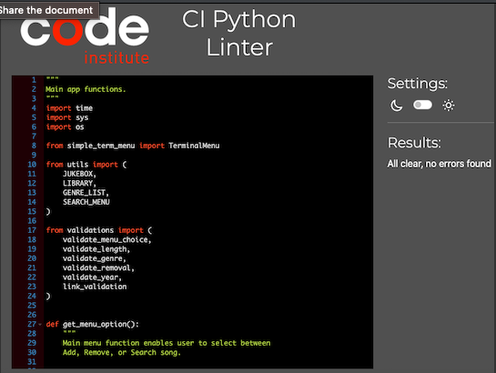

# Video JukeboX

## Intro

Video JukeboX is a library for music videos, which is run in the Code Institute mock terminal on Heroku.

Users can store their favourite music videos all in one place and play them via the stored link in the library. Users can add or remove songs, search through the library or display the entire library.

[Link to deployed Heroku site](https://yt-jukebox.herokuapp.com/)

[Link to Github repository](https://github.com/mtmanning93/yt-jukebox)

## Contents
 - [App Features](#app-features)
    - [Add Song](#add-song)
    - [Remove Song](#remove-song)
    - [Search JukeboX](#search-jukebox)
    - [Display All](#display-all)
- [Future Implementations](#future-implementations)
- [Testing](#testing)
    - [Bugs](#bugs)
    - [Code Validation](#code-validation)
- [Deployment](#deployment)

## App Features

### Add Song

The add song feature enables the user to add a song to their library through the inputs of artist name, song title, genre, year and link.

- Artist Name, Song Title
    - These inputs validates whether the user input is no longer than 40 characters long and if so asks the user to shorten the input.

- Genre
    - When the user enters a genre which is not already in the library it is extracted from the library and added to the 'genre-list', available to the user when using the [Search JukeboX](#search-jukebox) feature.

- Year
    - A user must insert a year when adding a new song this enables easier searching later on and the ability to list songs from the same year. It is validated to ensure the input is an integer, 4 digits long and within the dates of 1900 to current year. Current year is used from the 'datetime' import instead of a set year to ensure app usability in the future.

- Link
    - The link is the final input. In order to add a link the app provides a link to the youtube search. Generated by the concatenating the artist name and song title input. Once the user has found the desired video link they can copy and paste it into the input field. Here it is checked whether it is a url or not via the validators import.

Finally the song the app checks the library for other instances of the same url, as then a user could have multiple videos of the same song, if a duplicate is being created a message tell the user it already exists and gies two menu options to either access the songs details or restart the app.

When the add song process is finished the app provides a clear message that the song has been added to the library and automatically restarts the app. Ensuring the app is up to date with new song and the user is able to immediately search for the same song.

### Remove Song

Within the remove song feature a user has the ability to search the entire library for a given song. When the song is found in the library a menu appears for the user to select from. The song they select gets deleted from the library. The final option in the menu however is always 'cancel' by hitting cancel the app restarts and no song is deleted.

### Search JukeboX

- Artist Name/ Song Title Search

This feature allows a user to search the library using a number of different methods. The user can select from artist name, song title, genre and year. Here in todays world the song title and artist name can contain any characters so with these methods the app validates the length again. 

- Genre Search

However if the user selects method 'C) Genre' they are presented with a list of genres, populated by the genres in the library. The list is only populated by one instance of each genre. If the user input is not in the list they are prompted to try again and select from the list.

- Year Search

In search type year a user must enter a valid year as a 4 digit number. The app then searches the library if the input was valid. If the year is found a list of all songs in the year is provided, otherwise it prompts the user to search again and returns to the search type menu.

### Display All

The final feature displayed in the main menu simply displays all songs in the library plus a 'restart' option at the bottom. From this list the user can select a song which will open the song file displaying all relevant information including the video link. Underneath a small menu is shown given the user an option to return 'home' or 'back to list' which wil return the user to the display all songs list.

 

## Future Implementations

Future implementations would include an in app video or audio player. When finding a song the user will be able to play it directly in the app or at least open in a new browser tab.

Following this the ability to download entire playlists created by search methods in order to player all songs uninterrupted.

## Testing

- Throughout the build the app was constantly testing using my local terminal within gitpod.

- Once deployed further testing was carried out via the Code Institute Heroku terminal. No errors were displayed.

### Bugs

- Search type year
    - Initially when searching via a year the app would not find any songs in the library to display to the user. The year input was converted to an integer, however in order to search the library it had to be converted a string.

- Splitting Code
    - When seperating the app into different files several errors appeared, the main error was an `ImportError`. On research I found this was due to circular dependency. This meant having to refactor my functions to display the same output but work in a seperate file. *(Seperated between run/ utils and validations.py)* 

### Code Validation

- CI Linter

    - All code files have been passed through a PEP8 linter where no errors were found.

## Deployment

The app was deployed with Code Institutes mock terminal on the [Heroku](https://www.heroku.com) site, steps to deployment were as follows:

    - Create new Heroku app
    - Choose app name and region
    - In the settings
        - Set Config Vars
        - Add Build Packs (in this order):
            - Python
            - NodeJS
    - In deploy tab
        - Connect to ['yt-jukebox'](https://github.com/mtmanning93/yt-jukebox) Github repository
        - Enable automatic deploys
    - Click deploy

[Link to deployed Heroku site](https://yt-jukebox.herokuapp.com/)

## Credits

### ['Love Sandwiches' by Code Institute](https://github.com/Code-Institute-Solutions/love-sandwiches-p5-sourcecode/blob/master/05-deployment/01-deployment-part-1/run.py)

- Wiring Google Sheets API
    - *utils.py, line:11*
- Input validations and while loops 
    - *try and except (validations.py, line: 124)*  

### [Stack Overflow](https://stackoverflow.com/questions/14907067/how-do-i-restart-a-program-based-on-user-input)

- Restarting and clearing CLI using `import os'
    - `reboot()` function *run.py line: 534*

- How to find the function name from a dictionary value set as a function call
    - ["__ name __"](https://stackoverflow.com/questions/58454090/how-to-find-function-name-only-in-the-dictionary)
        - *run.py line: 44*

### [PyPi](https://pypi.org/project/simple-term-menu/)

- Simple_Term_Menu
    - This documentation helped implement the `TerminalMenu`.
        - *run.py line: 97*

### [Programmiz](https://www.programiz.com/python-programming/time/sleep)

- `time.sleep()` implementation used throughout the app.

### [Validators](https://validators.readthedocs.io/en/latest/)

- Used to validate the url input when adding a song to the library
    - *validations.py line: 85*